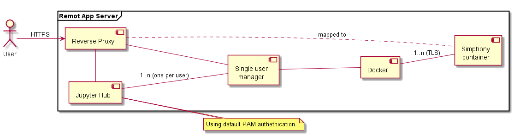
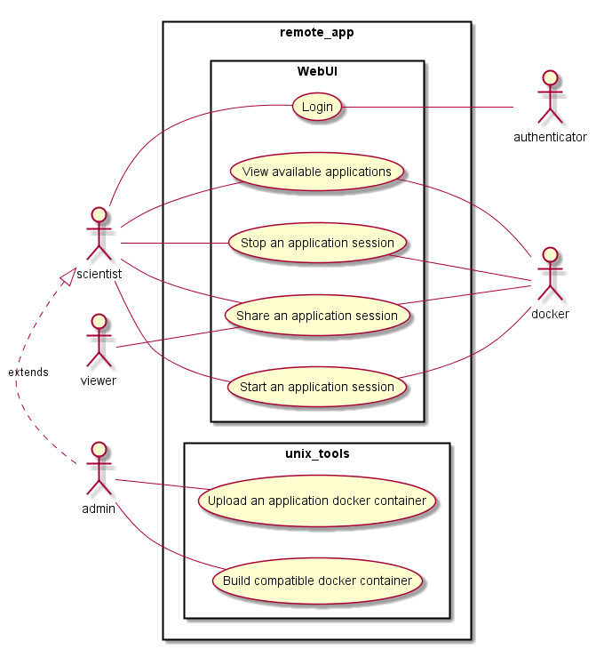
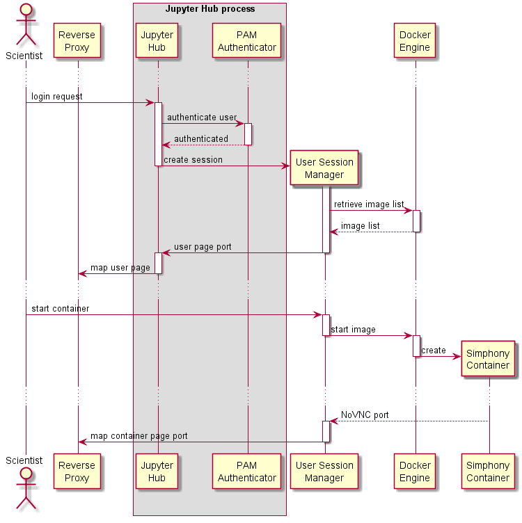

Design
======

Simphony remote is derived from the Jupyterhub design with a custom single user
application that manages the available docker images for each user (Fig 1).

Components
----------

  **Figure. 1:** Component diagram a basic remote app server based on the Jupyter hub
  infrastructure.

  - **Reverse proxy**: Proxy: the public facing part of the server
    that uses a dynamic proxy to route HTTP requests to the Hub and
    Single User Servers.
  - **Jupyter Hub**: manages user accounts and authentication and
    coordinates Single Users Servers using a Spawner.
  - **Single user manager**: A web server to manage the images and the
    active sessions. There is one such server for each authenticated user.
  - **Docker**: The docker engine managing the docker containers.

Usecases
--------

   **Figure 2**: Basic usecases

A Scientist should be able to:

- Login
- Inspect the available docker images
- Start a new session
- Stop a running session
- Share a session with another user

Furthermore an Administrator should be able to:

- Build compatible docker images
- Upload docker images.

The above design as of version 0.1 supports the usecases (see example in Fig 3):

   **Figure 3**: Sequence diagram of an authorised user starting a remote session.
